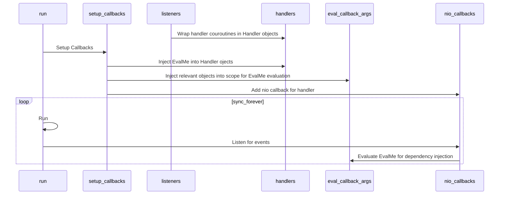

## How can I contribute?

Thank you for taking your time to view and possibly contribute to simplematrixbotlib!

### Reporting Bugs

To report a bug in simplematrixbotlib, select the bug report template from [here](https://codeberg.org/imbev/simplematrixbotlib/issues/new/choose) and replace the default and blank values with the appropriate information. You can also join simplematrixbotlib's Matrix room located at [#simplematrixbotlib:matrix.org](https://matrix.to/#/#simplematrixbotlib:matrix.org) to discuss your problem with members.

### Suggesting Features

To suggest a feature for simplematrixbotlib, select the feature request template from [here](https://codeberg.org/imbev/simplematrixbotlib/issues/new/choose) and add clear and precise details concerning your suggestion.

### Improving the Source Code

If you want to contribute to simplematrixbotlib, the most direct method is to improve the source code.

- Discuss your planned improvements with a maintainer in our [Matrix Room](https://matrix.to/#/#simplematrixbotlib:matrix.org) to ensure that they are aligned with the goals of this project.
- Fork the repository, and create a new branch for your issue (e.g. 60/decryption-error).
- Make your changes. Each distinct change should be in a separate commit with a descriptive commit message written in [imperative mood](https://en.wikipedia.org/wiki/Imperative_mood).
- Make a pull request and receive feedback. Make changes in response to feedback.
- Before a maintainer merges the pull request, the branch should have no conflicts with the master branch. Merge the master branch into the branch and ensure that the updates are not disruptive.

The following is a diagram to help contributors understand simplematrixbotlib's implementation of [Dependency Injection](https://en.wikipedia.org/wiki/Dependency_injection).

